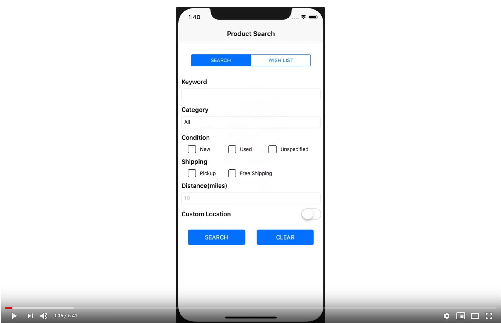

# eBaySearch-iOS

This application was built for USC's CSCI571 Web Technologies Course and is the mobile version of eBaySearch.

## Description

The purpose of the app is to demonstrate knowledge of the Swift programming language and basic iOS development. The web application provides a form for the user to query eBay items and navigate through item results, item details, and giving an option for the user to wishlist a product they want to revisit later.

## Getting Started

### Screenshot

Click on the screenshot to visit a video of the app in action.

### Dependencies

This project requires A recent MacOS operating system and XCode. Simply download the source code, `cd` into the root directory, and run `pod install` to install Cocoapod dependencies. In addition, `cd` into the Server folder and run `npm install` as well to install the necessary dependencies for the front-end of the project.

### Executing program

* Clone the project
* Open `Constants.sample.swift`, add the proper values to the environment variables, and change filename to `Constants.swift`
* In the Server directory, run `node server.js` and navigate to SERVER_PATH
* Open project.xcworkspace in XCode, choose iPhone X or iPhone XS as the simulator and run (Must be either of these two, because autoconstraints were not used for this project)

## Version History

* 0.1
    * Initial Release
